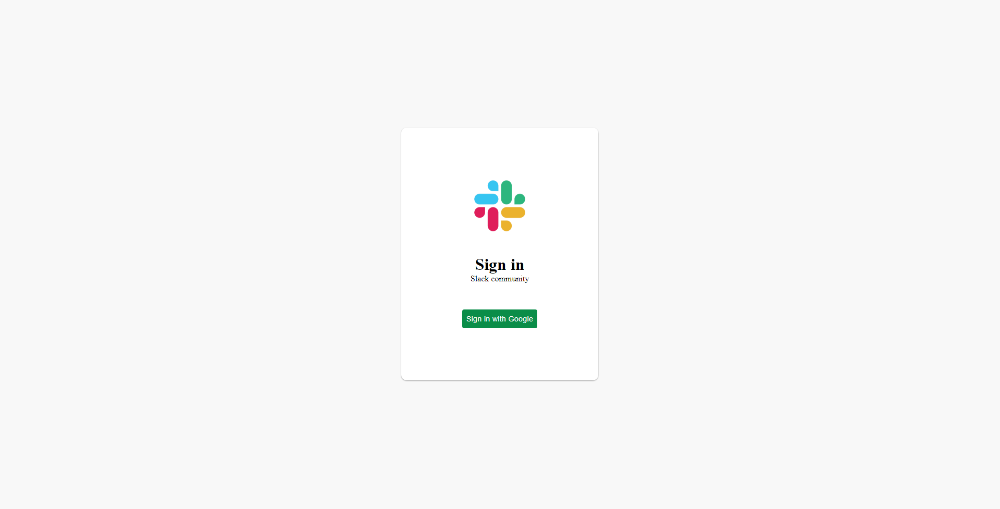
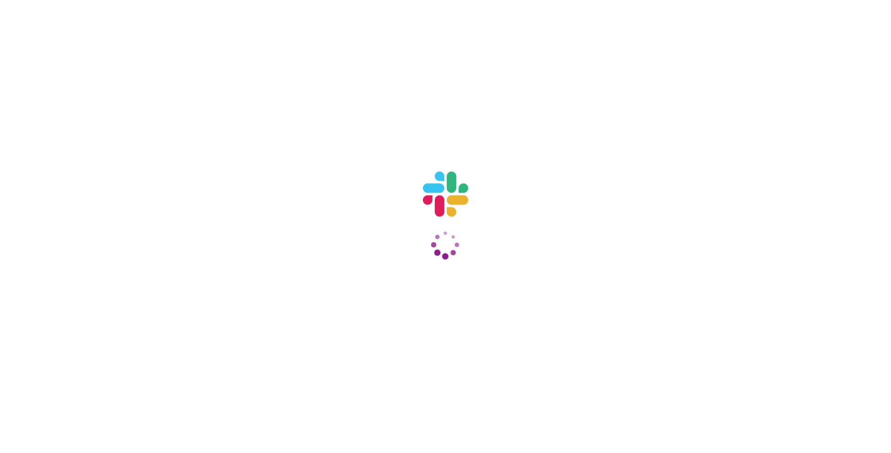
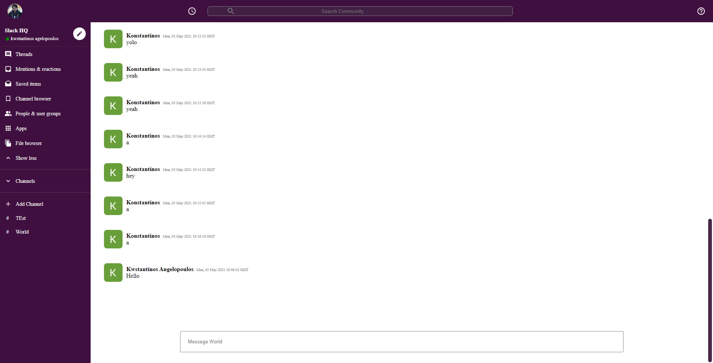

# Slack clone

A [Slack](https://slack.com/intl/en-gr/) clone using [React JS](https://reactjs.org), [Redux JS](https://redux.js.org), [Material UI](https://material-ui.com) & [Styled Components](https://www.codewars.com/users/CyberBoy) for the front-end and [Firebase](https://firebase.google.com) for authorization, authentication and Storage. Inspired by [this tutorial](https://www.youtube.com/watch?v=QiTq5WrWoJw).

<div align="center">
  <h1><a href="http://kangelopoulos.ddns.net:8080/slack"> DEMO </a></h1>
</div>


## Requirements

Inside the repo there is a [.env.example file](./slack/.env.example). Rename it to .env and fill the values with your own api keys.

For firebase you will need a firebase config file from your webapp with the following values.

```javascript

REACT_APP_FIREBASE_API_KEY=
REACT_APP_FIREBASE_AUTH_DOMAIN=
REACT_APP_FIREBASE_PROJECT_ID=
REACT_APP_FIREBASE_STORAGE_BUCKET=
REACT_APP_FIREBASE_MESSAGING_SENDER_ID=
REACT_APP_FIREBASE_APP_ID=
REACT_APP_FIREBASE_MEASUREMENT_ID=
```

## Installation

Assuming you have [npm](https://www.npmjs.com) installed, clone the repo and run the following code inside the [cloned folder](slack/):

```
  npm install
```

## Usage

Inside the [cloned folder](slack/) run:

```
npm start
```

## Example

<p align="center">
   
   
   
</p>